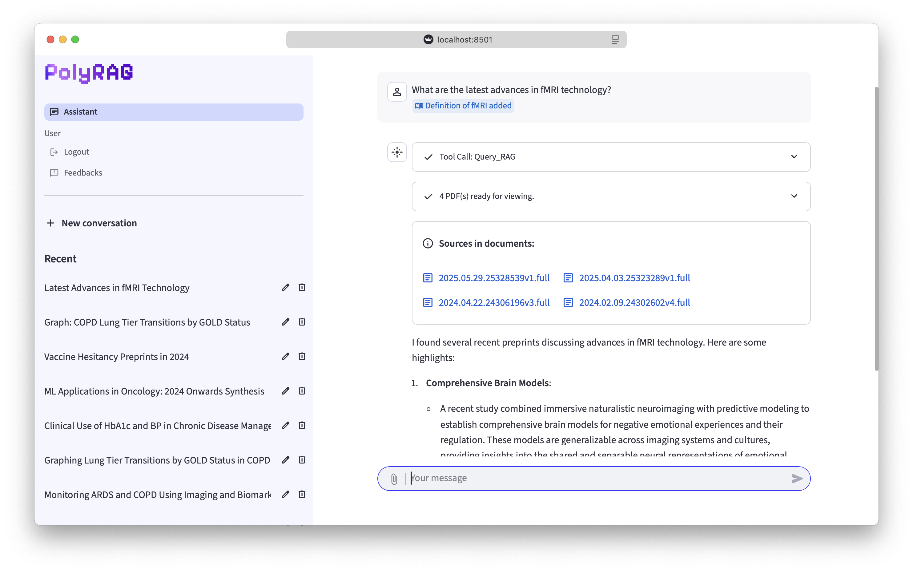
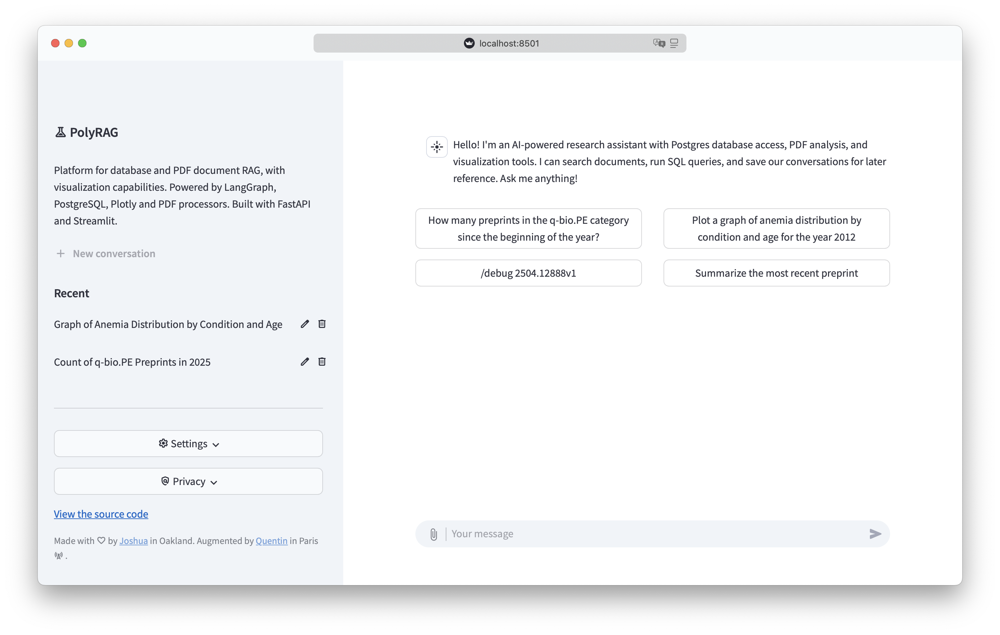
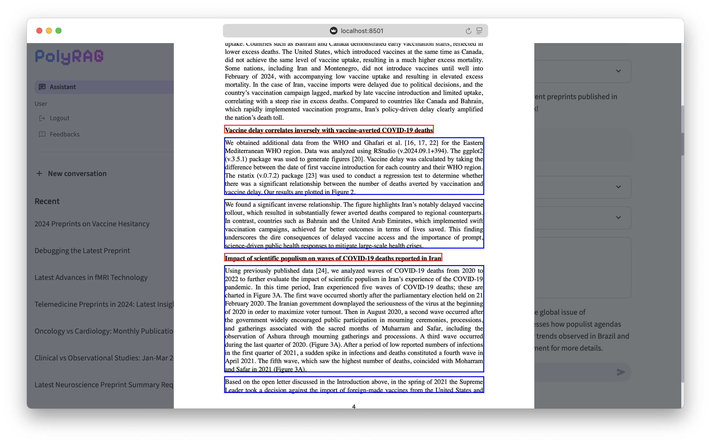
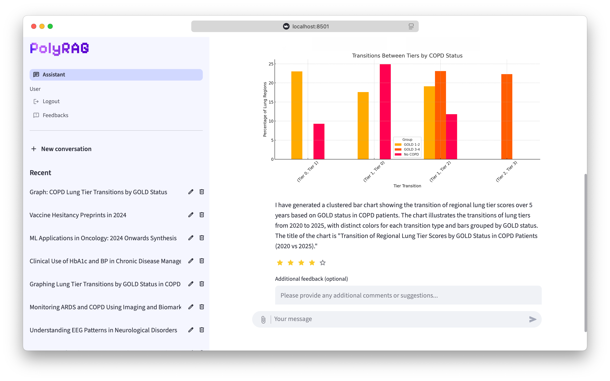
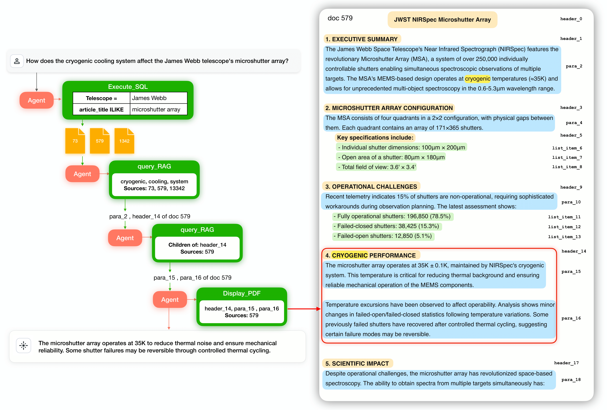
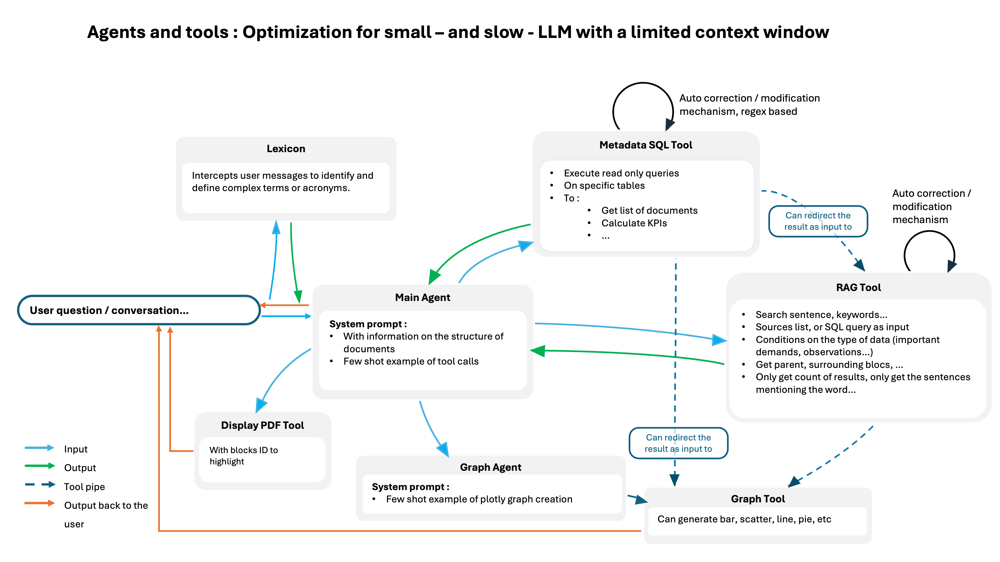

<p align="center">
  
</p>

**Agentic RAG for Small LLMs — Modular, Orchestrated, and Context-Smart**

---

PolyRAG is an **agentic Retrieval-Augmented Generation (RAG) framework** designed to empower **small and local LLMs**: At its core, PolyRAG is built around modular, orchestrated agents—each specialized for a class of tasks and able to coordinate powerful toolchains. Every aspect is optimized for limited context windows, slower models, and on-premise or privacy-focused deployments. 

---

## Agentic Architecture

- **Agents** are modular, specialized entities that coordinate complex tasks, delegate subtasks to tools, and manage context flow.
- **Agent Orchestration:** Agents can call other agents or tools, pipe outputs directly, and adaptively route information to minimize context usage.
- **Agent-Tool Synergy:** Tools are robust to imperfect inputs and return concise, high-quality outputs. Agents decide when to use which tool, and how to chain them for optimal results.
- **Direct-to-User Output:** Tools and agents can send data directly to the user, bypassing the main agent to preserve context and maximize efficiency.

This agentic design is what enables PolyRAG to get the most out of small or local LLMs, supporting advanced workflows that would otherwise overwhelm limited context windows.


### Conversational Research Assistant (Agent-Orchestrated)


*Ask complex research questions and get precise, sourced answers. Accesses lexicon, finds paragraphs in documents*

---

### Suggestion buttons for the user


*Choose from a menu of advanced actions: synthesize literature, run SQL, generate graphs, and more. Each action is handled by specialized agents and tools, minimizing context usage.*

---

### Contextual PDF Highlighting


*View PDFs with automatically highlighted, contextually relevant blocks—extracted.*

---

### Data Visualization from Natural Language (Agent-Tool Chaining)


*Generate publication trend graphs and other visualizations from natural language requests, with results piped through the agent-tool chain.*

---

### End-to-End Agent Orchestration


*See how PolyRAG chains SQL, RAG, and PDF tools to answer technical questions—each step coordinated by agents for context efficiency.*

---

### Architecture: Built for Agentic Workflows


*Agents and tools are designed to pipe outputs directly, auto-correct imperfect inputs, and minimize main agent context load. Every feature is built for small, slow, or local LLMs.*

---

## Document Extraction & Indexing

- **Semi-structured Extraction:**  
  - Uses NLM Ingestor and Tika with data type detection and tree structure.
  - Localization and regex rules for extracting structured parts.
  - Produces a structure with type, parent, child, and position.

- **Indexing:**  
  - Uses PostgreSQL TSVector (French) for efficient, scalable full-text search with tokenization and stemming.
  - No embeddings by default: lighter, scalable, and future-ready for on-premise models.
  - Excellent performance for technical queries.

---

## Features Overview

- Agentic RAG: Modular agents for database and document queries.
- Interactive PDF viewer with contextual highlights.
- Natural language to SQL and graphing, coordinated by agents.
- Conversation history, feedback, and moderation.
- Docker and Python support for easy deployment.


## ⚡ Quick Start

### Run with Python

```sh
# Set required environment variables. Check in .env.example for values to put in .env

# Install dependencies (uv recommended)
pip install uv
uv sync --frozen
source .venv/bin/activate

# Run the service
python src/run_service.py

# In another terminal
source .venv/bin/activate
streamlit run src/streamlit-app.py
```

---

## 🗄️ Database Setup

To quickly get started with real data as shown in the screenshots, you can populate your PostgreSQL database using the following dump:

**[Download the demo database dump (Google Drive)](https://drive.google.com/file/d/1sN6-1vx18vGjRGosKPJtoLiocb_ulP56/view?usp=sharing)**

This dump contains metadata and vectorized PDFs from medrxiv (first half of 2025), enabling you to reproduce the demo experience out of the box.

To restore the dump:
```sh
# Example command (adjust connection details as needed)
pg_restore -d your_database_name -U your_postgres_user -h your_postgres_host -p your_postgres_port /path/to/downloaded/dump_file
```

---

## ⚙️ Configuration

All configuration is handled via environment variables in your `.env` file. See `.env.example` for a full list. Key options include:

- `OPENAI_API_KEY`, `AZURE_OPENAI_API_KEY`, `DEEPSEEK_API_KEY`, `ANTHROPIC_API_KEY`, `GOOGLE_API_KEY`, `GROQ_API_KEY`: API keys for supported LLM providers.
- `USE_AWS_BEDROCK`: Enable Amazon Bedrock integration (`true`/`false`).
- `AWS_KB_ID`: Amazon Bedrock Knowledge Base ID.
- `DATABASE_URL`: PostgreSQL connection string.
- `SCHEMA_APP_DATA`: Database schema for application data (default: `document_data`).
- `LANGUAGE`: Language for text search queries (default: `english`).
- `NLM_INGESTOR_API`: URL for the NLM Ingestor service.
- `UPLOADED_PDF_PARSER`: Parser for uploaded PDFs (`pypdf`, `nlm-ingestor`, etc.).
- `DISPLAY_TEXTS_JSON_PATH`: Path to display texts JSON.
- `SYSTEM_PROMPT_PATH`: Path to the system prompt file.
- `NO_AUTH`: Set to `True` to disable authentication (not recommended for production).

Copy `.env.example` to `.env` and fill in the required values for your setup.
